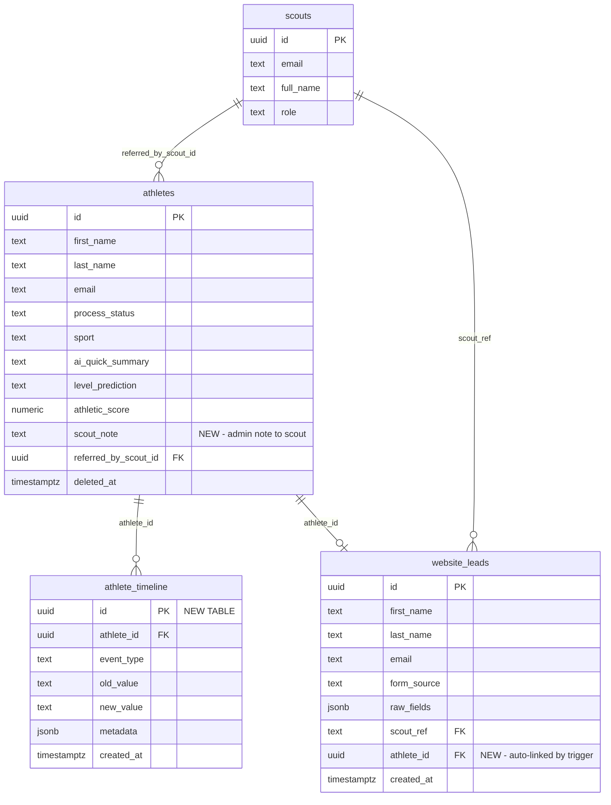

# Lead Management Enhancement

## Overview

Give scouts real-time visibility into their referred athletes' progress while requiring **zero extra work from the admin team**. Everything auto-flows from existing Quick View V4 workflows via Postgres triggers. Scouts see richer lead cards, an activity feed, status filters, and a unified journey from form submission to placement.

## Problem Statement

Today, scouts refer an athlete and then see almost nothing — a name, sport, status badge, and date. There's no feedback loop: scouts don't know if a lead was good, if the athlete is responding, or what stage they're at in detail. Admin has no channel to communicate back to scouts about specific leads. Website form submissions and tracked athletes show as two disconnected lists.

**Result:** Scouts disengage because they can't see impact. Admin can't coach scouts to send better leads.

## Proposed Solution

One automatic system powered by Postgres triggers + one optional manual field:

```
Admin works in Quick View V4 (as usual)
        |
        v
DB triggers catch changes automatically
        |
        v
Scout Portal shows updates instantly
```

### What Changes for Admin
- **Nothing mandatory.** Triggers fire on existing workflows.
- **One optional field:** `scout_note` text field in QV4 athlete detail modal — write a sentence when you want to tell the scout something.

### What Changes for Scouts
- **Activity feed** on dashboard showing recent status changes + admin notes
- **Richer lead cards** with AI summary, level prediction, mini progress bar
- **Unified lead list** — website submissions merge into athlete cards when linked
- **Filter pills + conversion funnel** to see pipeline at a glance

---

## Technical Approach

### Phase 1: Database Foundation (SQL migrations + triggers)

#### 1A. New Table: `athlete_timeline`

Automatically tracks status changes, notes, and linking events.

```sql
-- Migration: create_athlete_timeline
CREATE TABLE athlete_timeline (
  id UUID PRIMARY KEY DEFAULT uuid_generate_v4(),
  athlete_id UUID NOT NULL REFERENCES athletes(id) ON DELETE CASCADE,
  event_type TEXT NOT NULL,  -- 'status_change' | 'note_added' | 'lead_created' | 'lead_linked'
  old_value TEXT,            -- Previous status (for status_change)
  new_value TEXT,            -- New status or note content
  metadata JSONB,            -- Flexible: { form_source, website_lead_id, etc. }
  created_at TIMESTAMPTZ DEFAULT NOW()
);

-- Indexes for scout portal queries
CREATE INDEX idx_timeline_athlete ON athlete_timeline(athlete_id);
CREATE INDEX idx_timeline_created ON athlete_timeline(created_at DESC);
CREATE INDEX idx_timeline_athlete_created ON athlete_timeline(athlete_id, created_at DESC);

-- RLS: scouts see timeline for their athletes only
ALTER TABLE athlete_timeline ENABLE ROW LEVEL SECURITY;

CREATE POLICY "Scouts view own athletes timeline" ON athlete_timeline
  FOR SELECT USING (
    athlete_id IN (
      SELECT id FROM athletes
      WHERE referred_by_scout_id = (
        SELECT id FROM scouts WHERE email = (select auth.jwt()) ->> 'email'
      )
    )
  );

-- Admin full access
CREATE POLICY "Admin full access timeline" ON athlete_timeline
  FOR ALL USING (
    (select auth.jwt()) ->> 'email' IN (
      SELECT email FROM scouts WHERE role = 'admin'
    )
  );
```

#### 1B. Trigger: Auto-Track Status Changes

Fires only when `process_status` actually changes. Uses `WHEN` clause to avoid firing on every athlete update (important — QV4 inline edits, scrapers, and sync scripts update athletes constantly).

```sql
CREATE OR REPLACE FUNCTION log_athlete_status_change()
RETURNS TRIGGER AS $$
BEGIN
  INSERT INTO athlete_timeline (athlete_id, event_type, old_value, new_value)
  VALUES (NEW.id, 'status_change', OLD.process_status, NEW.process_status);
  RETURN NEW;
END;
$$ LANGUAGE plpgsql SECURITY DEFINER SET search_path = public;

CREATE TRIGGER trg_athlete_status_change
  AFTER UPDATE ON athletes
  FOR EACH ROW
  WHEN (OLD.process_status IS DISTINCT FROM NEW.process_status)
  EXECUTE FUNCTION log_athlete_status_change();
```

#### 1C. Trigger: Auto-Track Scout Note Changes

```sql
CREATE OR REPLACE FUNCTION log_athlete_scout_note()
RETURNS TRIGGER AS $$
BEGIN
  INSERT INTO athlete_timeline (athlete_id, event_type, new_value)
  VALUES (NEW.id, 'note_added', NEW.scout_note);
  RETURN NEW;
END;
$$ LANGUAGE plpgsql SECURITY DEFINER SET search_path = public;

CREATE TRIGGER trg_athlete_scout_note
  AFTER UPDATE ON athletes
  FOR EACH ROW
  WHEN (OLD.scout_note IS DISTINCT FROM NEW.scout_note AND NEW.scout_note IS NOT NULL)
  EXECUTE FUNCTION log_athlete_scout_note();
```

#### 1D. Add `scout_note` Column to Athletes

```sql
ALTER TABLE athletes ADD COLUMN scout_note TEXT;
```

#### 1E. Add `athlete_id` FK to Website Leads + Auto-Link Triggers

Bidirectional matching: fires when an athlete is created AND when a website lead is created. Handles both timing paths.

```sql
-- Add FK column
ALTER TABLE website_leads ADD COLUMN athlete_id UUID REFERENCES athletes(id);
CREATE INDEX idx_website_leads_athlete ON website_leads(athlete_id);

-- Shared matching function (called by both triggers)
CREATE OR REPLACE FUNCTION try_link_website_lead_to_athlete(
  p_email TEXT,
  p_athlete_id UUID DEFAULT NULL,
  p_website_lead_id UUID DEFAULT NULL
) RETURNS VOID AS $$
DECLARE
  v_normalized_email TEXT;
  v_athlete_count INT;
  v_athlete_id UUID;
  v_website_lead_ids UUID[];
BEGIN
  v_normalized_email := LOWER(TRIM(p_email));
  IF v_normalized_email IS NULL OR v_normalized_email = '' THEN
    RETURN;
  END IF;

  -- Path A: athlete was created/updated, find matching website leads
  IF p_athlete_id IS NOT NULL THEN
    UPDATE website_leads
    SET athlete_id = p_athlete_id
    WHERE LOWER(TRIM(email)) = v_normalized_email
      AND athlete_id IS NULL;

    -- Log the link event for each matched website lead
    FOR v_website_lead_ids IN
      SELECT ARRAY_AGG(id) FROM website_leads
      WHERE athlete_id = p_athlete_id
    LOOP
      IF v_website_lead_ids IS NOT NULL THEN
        INSERT INTO athlete_timeline (athlete_id, event_type, new_value, metadata)
        VALUES (p_athlete_id, 'lead_linked', 'Website lead auto-linked',
                jsonb_build_object('website_lead_ids', v_website_lead_ids));
      END IF;
    END LOOP;
    RETURN;
  END IF;

  -- Path B: website lead was created, find matching athlete
  IF p_website_lead_id IS NOT NULL THEN
    SELECT COUNT(*), MIN(id) INTO v_athlete_count, v_athlete_id
    FROM athletes
    WHERE LOWER(TRIM(email)) = v_normalized_email
      AND deleted_at IS NULL;

    -- Only auto-link if exactly 1 athlete matches (avoid ambiguity)
    IF v_athlete_count = 1 THEN
      UPDATE website_leads
      SET athlete_id = v_athlete_id
      WHERE id = p_website_lead_id AND athlete_id IS NULL;

      INSERT INTO athlete_timeline (athlete_id, event_type, new_value, metadata)
      VALUES (v_athlete_id, 'lead_linked', 'Website lead auto-linked',
              jsonb_build_object('website_lead_id', p_website_lead_id));
    END IF;
    RETURN;
  END IF;
END;
$$ LANGUAGE plpgsql SECURITY DEFINER SET search_path = public;

-- Trigger on athletes: when email is set/changed
CREATE OR REPLACE FUNCTION link_athlete_to_website_lead()
RETURNS TRIGGER AS $$
BEGIN
  IF NEW.email IS NOT NULL AND (TG_OP = 'INSERT' OR OLD.email IS DISTINCT FROM NEW.email) THEN
    PERFORM try_link_website_lead_to_athlete(NEW.email, p_athlete_id := NEW.id);
  END IF;
  RETURN NEW;
END;
$$ LANGUAGE plpgsql SECURITY DEFINER SET search_path = public;

CREATE TRIGGER trg_link_athlete_to_lead
  AFTER INSERT OR UPDATE ON athletes
  FOR EACH ROW
  EXECUTE FUNCTION link_athlete_to_website_lead();

-- Trigger on website_leads: when a new lead arrives
CREATE OR REPLACE FUNCTION link_website_lead_to_athlete()
RETURNS TRIGGER AS $$
BEGIN
  IF NEW.email IS NOT NULL THEN
    PERFORM try_link_website_lead_to_athlete(NEW.email, p_website_lead_id := NEW.id);
  END IF;
  RETURN NEW;
END;
$$ LANGUAGE plpgsql SECURITY DEFINER SET search_path = public;

CREATE TRIGGER trg_link_lead_to_athlete
  AFTER INSERT ON website_leads
  FOR EACH ROW
  EXECUTE FUNCTION link_website_lead_to_athlete();
```

#### 1F. Security Fix: Athletes RLS Policy

**Pre-existing bug**: current policy has `OR referred_by_scout_id IS NULL` which exposes ~900 unassigned athletes to every scout. Fix this before adding scout_note and timeline.

```sql
-- Drop the leaky policy
DROP POLICY IF EXISTS "Scouts can view referred athletes" ON athletes;

-- Replace with scoped policy
CREATE POLICY "Scouts can view referred athletes" ON athletes
  FOR SELECT USING (
    referred_by_scout_id IN (
      SELECT id FROM scouts WHERE (select auth.jwt()) ->> 'email' = email
    )
  );
```

#### 1G. Backfill Timeline from Existing Data

Seed `athlete_timeline` with current status for all scout-referred athletes so timelines aren't empty.

```sql
-- Backfill: create a "lead_created" event for each existing referred athlete
INSERT INTO athlete_timeline (athlete_id, event_type, new_value, created_at)
SELECT id, 'lead_created', process_status, created_at
FROM athletes
WHERE referred_by_scout_id IS NOT NULL
  AND deleted_at IS NULL;

-- If change_history table exists with status changes, backfill those too
-- (verify table exists first, run manually)
-- INSERT INTO athlete_timeline (athlete_id, event_type, old_value, new_value, created_at)
-- SELECT athlete_id, 'status_change', old_value, new_value, created_at
-- FROM change_history
-- WHERE field_name = 'process_status'
--   AND athlete_id IN (SELECT id FROM athletes WHERE referred_by_scout_id IS NOT NULL);
```

#### 1H. Auto-Link Existing Website Leads (One-Time)

Run after creating the `athlete_id` column to link any existing matches.

```sql
-- One-time backfill: link website leads to athletes by email
UPDATE website_leads wl
SET athlete_id = a.id
FROM (
  SELECT DISTINCT ON (LOWER(TRIM(email))) id, LOWER(TRIM(email)) as norm_email
  FROM athletes
  WHERE email IS NOT NULL AND deleted_at IS NULL
  ORDER BY LOWER(TRIM(email)), created_at DESC
) a
WHERE LOWER(TRIM(wl.email)) = a.norm_email
  AND wl.athlete_id IS NULL;
```

---

### Phase 2: Quick View V4 — Scout Note Field

**Files to modify:**
- `~/code/data-ausa/quick-view-v4/src/columns.js` — add `scout_note` to column definitions
- `~/code/data-ausa/quick-view-v4/src/components/AthleteDetailModal.jsx` (or equivalent detail panel) — add editable text field in a "Scout Info" section
- `~/code/data-ausa/quick-view-v4/src/lib/supabaseClient.js` — include `scout_note` in athlete SELECT query

**Behavior:**
- Optional text field, collapsed by default in the detail modal
- Placed near `referred_by_scout_id` / commission fields (scout-related section)
- Saves on blur (same as other inline edits in QV4)
- Trigger handles timeline logging automatically

---

### Phase 3: Scout Portal — Enhanced Data Layer

**File: `~/code/data-ausa/scout-portal/src/lib/supabase.js`**

#### 3A. Enrich `getScoutLeads()` query

Current (line 36-43): fetches only 6 columns.

```javascript
// BEFORE
export async function getScoutLeads(scoutId) {
  const { data, error } = await supabase
    .from('athletes')
    .select('id, first_name, last_name, process_status, created_at, sport')
    .eq('referred_by_scout_id', scoutId)
    .order('created_at', { ascending: false })
  if (error) throw error
  return data
}

// AFTER
export async function getScoutLeads(scoutId) {
  const { data, error } = await supabase
    .from('athletes')
    .select(`
      id, first_name, last_name, process_status, created_at, sport,
      profile_photo_url, ai_quick_summary, level_prediction,
      athletic_score, scout_note, position_primary, updated_at
    `)
    .eq('referred_by_scout_id', scoutId)
    .is('deleted_at', null)
    .order('created_at', { ascending: false })
  if (error) throw error
  return data
}
```

#### 3B. New query: `getScoutTimeline(scoutId)`

For the dashboard activity feed — fetch recent timeline events across all of the scout's athletes.

```javascript
export async function getScoutTimeline(scoutId) {
  // Get athlete IDs first, then timeline (RLS handles scoping)
  const { data, error } = await supabase
    .from('athlete_timeline')
    .select(`
      id, athlete_id, event_type, old_value, new_value, metadata, created_at,
      athlete:athletes(first_name, last_name)
    `)
    .order('created_at', { ascending: false })
    .limit(20)
  if (error) throw error
  return data
}
```

#### 3C. New query: `getLeadTimeline(athleteId)`

For the lead detail modal — fetch timeline for a specific athlete.

```javascript
export async function getLeadTimeline(athleteId) {
  const { data, error } = await supabase
    .from('athlete_timeline')
    .select('id, event_type, old_value, new_value, metadata, created_at')
    .eq('athlete_id', athleteId)
    .order('created_at', { ascending: true })
  if (error) throw error
  return data
}
```

#### 3D. Update `getWebsiteLeads()` to include `athlete_id`

```javascript
// Add athlete_id to the select
export async function getWebsiteLeads(scoutId) {
  const { data, error } = await supabase
    .from('website_leads')
    .select('id, first_name, last_name, email, sport, form_source, raw_fields, created_at, athlete_id')
    .eq('scout_ref', scoutId)
    .order('created_at', { ascending: false })
  if (error) throw error
  return data
}
```

#### 3E. Extract shared constants

Create `~/code/data-ausa/scout-portal/src/lib/constants.js`:

```javascript
export const STATUS_CONFIG = {
  'Lead Created': { bg: 'bg-gray-100', text: 'text-gray-600', dot: 'bg-gray-400', order: 0 },
  'Eval Call':    { bg: 'bg-yellow-100', text: 'text-yellow-700', dot: 'bg-yellow-500', order: 1 },
  'Assessment':   { bg: 'bg-orange-100', text: 'text-orange-700', dot: 'bg-orange-500', order: 2 },
  'Signed':       { bg: 'bg-blue-100', text: 'text-blue-700', dot: 'bg-blue-500', order: 3 },
  'In Process':   { bg: 'bg-purple-100', text: 'text-purple-700', dot: 'bg-purple-500', order: 4 },
  'Placed':       { bg: 'bg-green-100', text: 'text-green-700', dot: 'bg-green-500', order: 5 },
}

export const STATUS_PIPELINE = Object.entries(STATUS_CONFIG)
  .sort((a, b) => a[1].order - b[1].order)
  .map(([key, val]) => ({ key, ...val }))

// Filter categories for the Leads page
export const FILTER_CATEGORIES = [
  { id: 'all', label: 'All', statuses: null },
  { id: 'new', label: 'New', statuses: ['Lead Created'] },
  { id: 'evaluating', label: 'Evaluating', statuses: ['Eval Call', 'Assessment'] },
  { id: 'active', label: 'Active', statuses: ['Signed', 'In Process'] },
  { id: 'placed', label: 'Placed', statuses: ['Placed'] },
]
```

---

### Phase 4: Scout Portal — Unified Leads Page

**File: `~/code/data-ausa/scout-portal/src/components/LeadsList.jsx`**

#### 4A. Unified Lead List Logic

When `website_leads.athlete_id` is set, that lead has been linked to an athlete. Remove it from the "Website Submissions" section and show a "Referred via your link" badge on the athlete card instead.

```
Leads Page Layout:
┌──────────────────────────────────────────────┐
│ Conversion Funnel Bar                        │
│ [20 submissions] → [8 pipeline] → [2 placed] │
├──────────────────────────────────────────────┤
│ Filter: [All] [New] [Evaluating] [Active] [Placed] │
├──────────────────────────────────────────────┤
│ ● WEBSITE SUBMISSIONS (unlinked only)    3   │
│ ┌────────────────────────────────────────┐   │
│ │ Max Testmann  Innenverteidiger  Jugend │   │
│ │ Showcase Form  Feb 24  ○ Under Review  │   │
│ └────────────────────────────────────────┘   │
├──────────────────────────────────────────────┤
│ ● YOUR ATHLETES                          5   │
│ ┌────────────────────────────────────────┐   │
│ │ [Photo] Ben Paukstat                   │   │
│ │ ⚽ Fußball  CB  🔗 Via your link       │   │
│ │ "Strong D2 candidate" — AI Summary     │   │
│ │ ████████░░  In Process  Feb 18         │   │
│ │ 💬 "Great find! Coaches love him" — HB │   │
│ └────────────────────────────────────────┘   │
└──────────────────────────────────────────────┘
```

**Key behaviors:**
- **Unlinked website leads** stay in green "Website Submissions" section with "Under Review" label
- **Linked website leads** disappear from green section; athlete card shows "Via your link" badge
- **Athletes without website lead** (direct referral) show normally, no badge
- **Filter pills** only filter the "Your Athletes" section (website leads are pre-pipeline)
- **Conversion funnel** shows: `{websiteLeads.length} submissions → {athletes.length} in pipeline → {placed.length} placed`

#### 4B. Richer Athlete Cards

Each athlete card shows:
- **Profile photo** (or initials fallback) — already in data
- **Name + sport + position** — `position_primary`
- **"Via your link" badge** — if matched to a website_lead
- **AI quick summary** — 1-liner from `ai_quick_summary`, truncated
- **Mini progress bar** — filled segments based on `process_status` order (0-5)
- **Status badge** — existing color-coded badge
- **Scout note** — if `scout_note` is set, show in a highlighted callout
- **Date** — `updated_at` or `created_at`

#### 4C. Filter Pills

```jsx
// Filter state
const [activeFilter, setActiveFilter] = useState('all')

// Filter logic (client-side, computed from already-loaded leads)
const filteredLeads = activeFilter === 'all'
  ? leads
  : leads.filter(l => FILTER_CATEGORIES
      .find(f => f.id === activeFilter)
      ?.statuses?.includes(l.process_status)
    )
```

Horizontal scrollable pills, styled like existing badges. Active pill gets filled background.

---

### Phase 5: Scout Portal — Enhanced Lead Detail

**File: `~/code/data-ausa/scout-portal/src/components/LeadDetail.jsx`**

Replace the static 6-stage timeline with a real activity timeline powered by `athlete_timeline`:

```
Lead Detail Modal:
┌──────────────────────────────────────┐
│ [Photo]  Ben Paukstat                │
│ ⚽ Fußball · CB · D2 Candidate       │
├──────────────────────────────────────┤
│ Current Status: ●● In Process        │
│ ████████████░░░  (stage 4/6)         │
├──────────────────────────────────────┤
│ 💬 Admin Note                        │
│ "Great find! Coaches love this kid.  │
│  D2 schools are responding well."    │
├──────────────────────────────────────┤
│ AI Assessment                        │
│ "Strong defensive player with good   │
│  aerial ability. D2/NAIA potential." │
├──────────────────────────────────────┤
│ Activity Timeline                    │
│                                      │
│ ● Feb 18 — Moved to In Process       │
│ │                                    │
│ ● Feb 10 — Admin note added          │
│ │ "Great find! Coaches love..."      │
│ │                                    │
│ ● Feb 5 — Moved to Signed            │
│ │                                    │
│ ● Jan 28 — Moved to Assessment       │
│ │                                    │
│ ● Jan 20 — Moved to Eval Call        │
│ │                                    │
│ ○ Jan 15 — Lead Created              │
│   via Showcase Form                  │
├──────────────────────────────────────┤
│ Commission: Pending (if placed)      │
└──────────────────────────────────────┘
```

- Fetches `getLeadTimeline(lead.id)` on modal open
- Renders chronological event list with icons per event type
- Shows `ai_quick_summary` in a dedicated section (not in timeline)
- Shows `scout_note` highlighted at the top if present

---

### Phase 6: Scout Portal — Dashboard Activity Feed

**File: `~/code/data-ausa/scout-portal/src/components/Dashboard.jsx`**

Replace the current "Link Activity" section (which only shows website form clicks) with a real activity feed.

```
Dashboard Activity Feed:
┌──────────────────────────────────────┐
│ 📋 Recent Activity                   │
│                                      │
│ Ben Paukstat moved to In Process     │
│ 2 days ago                           │
│                                      │
│ 💬 Note on Jonas Maierhofer          │
│ "Strong candidate, D2 potential"     │
│ 3 days ago                           │
│                                      │
│ Levin Fast moved to Signed           │
│ 1 week ago                           │
│                                      │
│ 🔗 Max Testmann linked to your lead  │
│ 2 weeks ago                          │
│                                      │
│ New form submission: Raoul Haase     │
│ Jan 25                               │
└──────────────────────────────────────┘
```

**Data source:** `getScoutTimeline(scoutId)` — fetches from `athlete_timeline` with athlete name join. Limit 20 most recent. Merge with recent `website_leads` entries for "new submission" events.

**No Realtime for V1.** Activity feed refreshes on page load. Add a pull-to-refresh or refresh button if needed. Realtime subscriptions can be added later.

---

## Entity Relationship Diagram



---

## Acceptance Criteria

### Functional Requirements
- [x] Status changes in QV4 automatically appear in Scout Portal timeline (no admin action)
- [ ] Admin can write optional `scout_note` in QV4 athlete detail; scout sees it on lead card
- [x] Website leads auto-link to athletes by email match (bidirectional: both insert paths)
- [x] Only exact single-match emails auto-link; ambiguous matches (multiple athletes) skip
- [x] Email matching uses normalized comparison (`LOWER(TRIM())`)
- [x] Linked website leads disappear from "Website Submissions" section; show badge on athlete card
- [x] Unlinked website leads remain in separate section with "Under Review" label
- [x] Dashboard shows activity feed with recent status changes, notes, and link events
- [x] Leads page has filter pills: All / New / Evaluating / Active / Placed
- [x] Leads page shows conversion funnel: submissions → pipeline → placed
- [x] Lead detail modal shows real activity timeline from `athlete_timeline` table
- [x] Lead detail shows `ai_quick_summary` and `scout_note` when available
- [x] Existing athletes backfilled with `lead_created` timeline event on migration

### Security Requirements
- [x] RLS enabled on `athlete_timeline` — scouts see only their referred athletes
- [ ] Fix existing athletes RLS: remove `OR referred_by_scout_id IS NULL` leak
- [x] Add `.is('deleted_at', null)` to `getScoutLeads()` query
- [x] All trigger functions use `SECURITY DEFINER SET search_path = public`
- [ ] Run `get_advisors(type: 'security')` after migration

### Non-Functional Requirements
- [x] Dashboard loads in <2s (parallel fetch: leads + timeline + website_leads)
- [x] Leads page handles 50+ leads without performance issues
- [x] Filter/funnel computed client-side from already-loaded data (no extra queries)
- [x] `STATUS_CONFIG` extracted to shared constants (deduplicate from 3 files)

---

## Build Sequence

| Step | What | Files | Effort |
|------|------|-------|--------|
| 1 | DB migration: `athlete_timeline` table + RLS + indexes | SQL migration | S |
| 2 | DB migration: triggers (status, note, bidirectional email link) | SQL migration | M |
| 3 | DB migration: `scout_note` on athletes, `athlete_id` on website_leads | SQL migration | S |
| 4 | DB migration: fix athletes RLS policy | SQL migration | S |
| 5 | DB migration: backfill timeline + auto-link existing website leads | SQL migration | S |
| 6 | QV4: add `scout_note` field to athlete detail modal | 2-3 QV4 files | S |
| 7 | Scout Portal: new queries in supabase.js + shared constants | 2 files | S |
| 8 | Scout Portal: unified LeadsList with filter pills + funnel | LeadsList.jsx | M |
| 9 | Scout Portal: enhanced LeadDetail with timeline + note + summary | LeadDetail.jsx | M |
| 10 | Scout Portal: dashboard activity feed | Dashboard.jsx | M |
| 11 | Security audit: `get_advisors` + verify RLS | SQL | S |

**S = Small (~30min), M = Medium (~1hr)**

Steps 1-5 are pure SQL (can be one migration file).
Step 6 is in a separate repo (QV4).
Steps 7-10 are Scout Portal frontend.
Step 11 is verification.

---

## Dependencies & Risks

| Risk | Mitigation |
|------|------------|
| Email matching links to wrong athlete (duplicates) | Only auto-link on exact single match; skip ambiguous |
| Trigger fires on every athletes UPDATE (performance) | `WHEN` clause limits to `process_status` / `scout_note` changes only |
| Timeline empty for existing leads | Backfill migration seeds `lead_created` events |
| QV4 `scout_note` field not used by admin | Make it optional, clearly labeled, low-friction (saves on blur) |
| RLS policy change breaks existing queries | Test with scout account before deploying |

## References

### Internal
- Scout Portal project CLAUDE.md: `~/code/data-ausa/scout-portal/.claude/CLAUDE.md`
- Supabase queries: `~/code/data-ausa/scout-portal/src/lib/supabase.js`
- Current LeadsList: `~/code/data-ausa/scout-portal/src/components/LeadsList.jsx`
- Current LeadDetail: `~/code/data-ausa/scout-portal/src/components/LeadDetail.jsx`
- Current Dashboard: `~/code/data-ausa/scout-portal/src/components/Dashboard.jsx`
- QV4 status update: `~/code/data-ausa/quick-view-v4/src/App.jsx:540-543`
- Feedback badge pattern (precedent): `~/code/data-ausa/scout-portal/src/components/FeedbackButton.jsx`
- RLS patterns: `~/.claude/rules/security.md`
- Realtime gotchas: `~/.claude/rules/supabase.md`

### Learnings Applied
- Verify `updated_at` column exists before UPDATE logic (memory/MEMORY.md)
- Wrap `auth.uid()` in `(select ...)` in RLS policies (rules/security.md)
- Compute stats client-side from loaded data, don't re-fetch (memory/MEMORY.md)
- `SECURITY DEFINER SET search_path = public` on all functions (rules/security.md)
